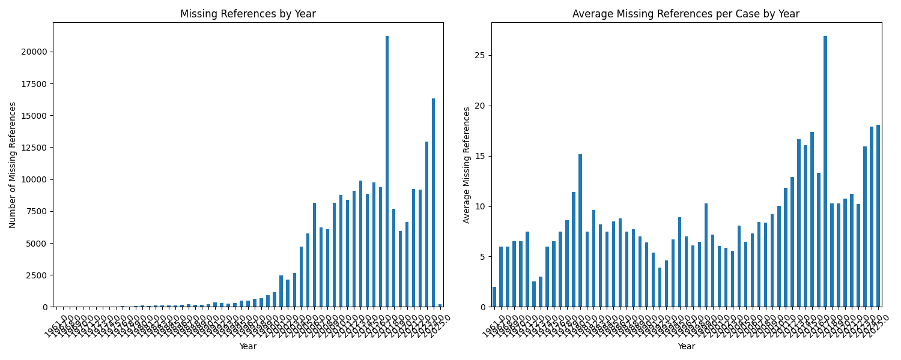
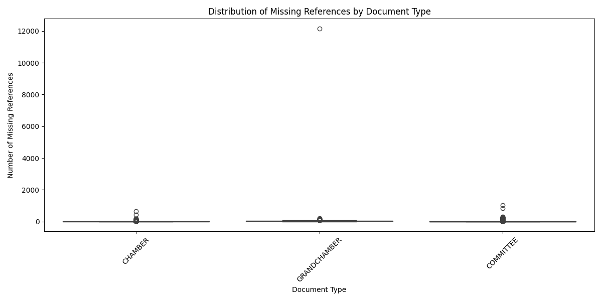
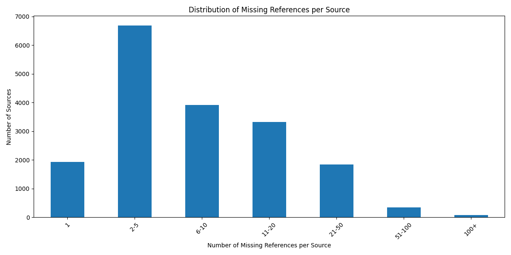

# Analysis of Missing References in ECHR Case Law

## Overview

This analysis examines missing references in ECHR case law documents, identifying patterns in citations, document types, and temporal distribution. The dataset contains 207,038 total missing references from 18,131 unique source documents.

## Key Findings

### 1. Types of Missing References

Missing references fall into three main categories:

- **Application Numbers** (130,611): References to cases not yet decided
- **Case Names** (40,196): Cases referenced by name without ECLI
- **SCL Application Numbers** (36,230): Secondary application numbers related to the main case

### 2. Temporal Distribution



The temporal analysis reveals:

- Gradual increase from 1960s through 1990s
- Sharp uptick after 2000, reflecting increased court activity
- Notable peak in 2017 (21,218 references)
- High numbers in recent years (2023-2024), likely representing pending cases

### 3. Document Type Distribution



References by document type:

- CHAMBER: 131,478 (63.2%)
- COMMITTEE: 47,922 (23.1%)
- GRANDCHAMBER: 27,637 (13.3%)

This distribution aligns with the Court's structure, where Chambers handle the majority of cases.

### 4. Importance Levels

References by importance level:

```
4.0 (lowest)  : 82,818 (40.0%)
3.0           : 73,714 (35.6%)
1.0 (highest) : 35,665 (17.2%)
2.0           : 14,840 (7.2%)
```

### 5. Distribution of Missing References



Number of missing references per source:

```
1 reference    : 1,938 sources
2-5 references : 6,690 sources
6-10 references: 3,919 sources
11-20 refs    : 3,327 sources
21-50 refs    : 1,840 sources
51-100 refs   :   338 sources
100+ refs     :    79 sources
```

## Notable Cases

The most significant case in terms of missing references is:

```
ECLI:CE:ECHR:2017:1012JUD004685213
- Missing references: 12,167
- Type: GRANDCHAMBER
- Importance: 1.0 (highest)
- Reference types:
  - Application numbers: 12,137
  - SCL application numbers: 30
```

This appears to be a pilot judgment addressing systemic issues, hence the large number of referenced applications.

## Methodology

Analysis performed using Python with pandas, matplotlib, and seaborn libraries. Source code available in `load/edges.ipynb`.

## Data Sources

- Missing cases data: `data/METADATA/missing_cases.csv`
- Metadata: `data/METADATA/echr_metadata.csv`

## Detailed Analysis Files

- Full reference distribution: `analysis/missing_refs_per_source.csv`
- Extreme cases analysis: `analysis/extreme_cases_analysis.csv`
